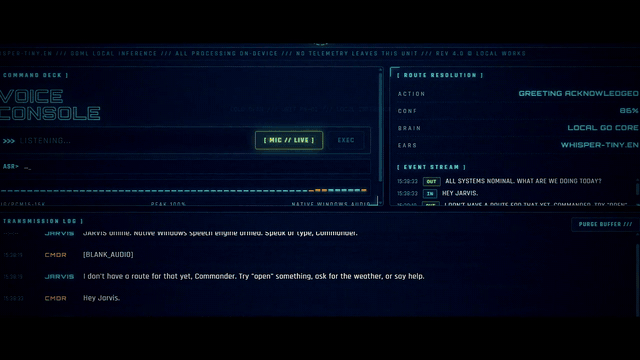

# JARVIS — Windows Native Desktop Edition

> **Iron-Man-style voice assistant. Fully local. Zero cloud. Zero subscriptions.**

Say "open YouTube" out loud → it opens. Ask for the weather → it answers in a real voice. All of it happens **on your machine** — your speech never touches a server.

## 🎬 See it in action



*Voice command goes in, JARVIS executes it. Full demo video (no audio): [demo/jarvis_intro_720p_nomusic.mp4](demo/jarvis_intro_720p_nomusic.mp4)*

   

```
bin\Jarvis.exe    <- double-click it. That's the whole install.
```

## Why fully local?

Every "voice assistant" you've used ships your audio to someone else's server. JARVIS flips that:

- **Privacy by architecture** — audio is captured in Go, POSTed to a localhost
  whisper-server on port 8919, and transcribed offline. Speech never leaves the machine.
- **Zero cost to run** — no API keys, no metered transcription, no subscription.
- **Zero latency** — recognition round-trip is localhost, not a datacenter.

## How it works

```
 mic (winmm waveIn 16kHz)
        │  energy VAD + streaming partials
        ▼
 whisper-server.exe (localhost:8919)   ←── whisper.cpp tiny.en, GGML
        │  transcript + confidence
        ▼
 Go brain (fuzzy intent router, filesystem index)
        │  action + reply
        ├──▶ Windows SAPI voice  ("mouth")
        └──▶ React HUD over Wails v2  ("face")
```

## Architecture

| Layer | Tech |
|---|---|
| Shell / window | Wails v2 (Go + native WebView2) |
| Ears | whisper.cpp `tiny.en` — local GGML inference via bundled `whisper-server.exe` |
| Mic | winmm (`waveIn`) 16 kHz capture with energy VAD + streaming partials |
| Mouth | Windows SAPI synthesis, female voice auto-selected by gender (Zira/Aria/...) |
| Brain | Pure Go: fuzzy intent router, filesystem index, weather, math, notes, timers |
| Face | React + Vite, Stark HUD deck |

## Capabilities

- **Open anything** — 160+ websites and 40+ apps (including Start Menu
  resolution for any installed program), fuzzily matched: "opena yutab" still
  opens YouTube
- **Close apps** — "close notepad", "quit spotify": graceful WM_CLOSE first,
  forced kill if the app refuses
- **Local media & files** — "play despacito", "open the amazing video":
  indexes Videos/Music/Pictures/Downloads/Desktop/Documents and fuzzy-matches
  filenames
- **Folders** — open any folder by name; "what's in downloads" reads its
  contents aloud; "rescan" rebuilds the index
- **Yes/no memory** — "Did you mean Whatsapp?" → say "yes" and it opens
- `weather in <city>` — live wttr.in, keyless; no city = auto-location
- time / date, status reports, notes (saved to `%APPDATA%\JARVIS\notes.txt`)
- `set a timer for 5 minutes` — real system beep alarm
- voice math: "what is 12 times 9"
- varied replies — no canned "acknowledged" loops

## Controls

- **ALT+SPACE** — toggle listening
- **/** — focus command line, **ESC** — blur
- New voice commands interrupt current speech (barge-in)

## Project structure

```
Jarvis/
├── main.go / app.go      Wails app binding + command pipeline
├── brain/                intent router, sites/apps index, tools (pure Go)
├── sapi/                 Windows SAPI text-to-speech bindings
├── whisper/              whisper-server spawn + mic capture client
└── frontend/             React + Vite Stark HUD
```

## Development

```
go test ./brain/                  # brain unit tests
npm --prefix frontend run build   # rebuild UI into frontend/dist
go build -trimpath -tags desktop,production -ldflags "-s -w -H windowsgui" -o bin/Jarvis.exe .
# or, with the wails CLI installed: wails dev / wails build
```

The `-tags desktop,production` flags are required — a plain `go build`
produces an exe that shows an error dialog.

## Runtime files (not in git)

Clone-ready except for the whisper runtime — download once:

1. [whisper-bin-x64.zip](https://github.com/ggml-org/whisper.cpp/releases) → extract into `whisper/bin/`
2. `ggml-tiny.en.bin` (~75 MB) → place in `whisper/models/`

## Roadmap

- [ ] Wake word: "Hey Jarvis" hands-free trigger
- [ ] LLM fallback brain for freeform questions (local Ollama or cloud)
- [ ] Face recognition greeting on approach
- [ ] Neural TTS option (Piper) alongside SAPI

## Notes

- Recognition uses your default microphone; everything runs locally.
- Voice preference: any installed female English SAPI voice, shown in the footer as `VOX:`.
- Whisper server logs land in `%TEMP%\jarvis-whisper-server.log`.
